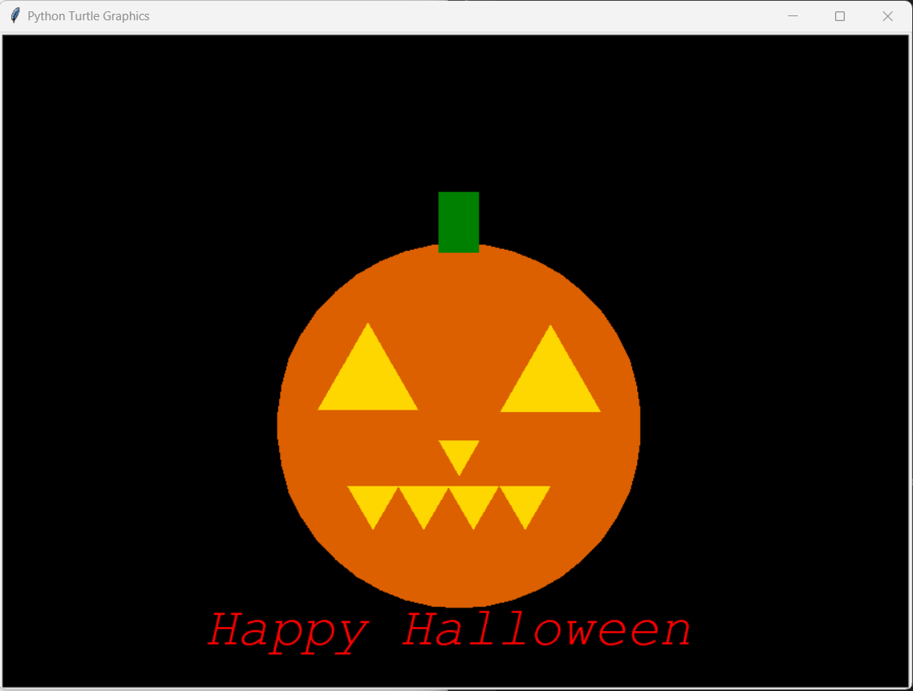

# draw-halloween-python-turtle

Aprenda a desenhar o Halloween em Python Turtle. O Halloween é celebrado nos países ocidentais e é dedicado àqueles que morreram como santos, mártires, etc. Vamos desenhar uma abóbora que é usada para celebrar o Halloween. Clique aqui para saber sobre o Halloween.

